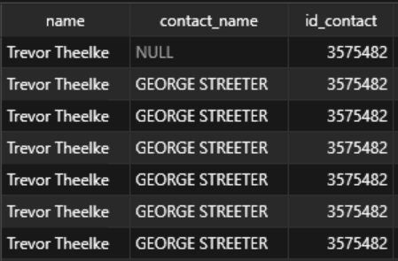
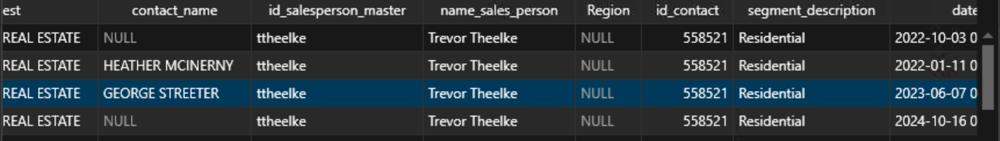

## Follow-up 
This document builds up on the call we had earlier on why some specific groups have more/less number of records than they had in the original table. For the sake of simplicity I am following the convention below.

**Parent  --- `NPL.fct_Order_History_Commissions`**

**Derived --- ` NPL_qa.fct_Order_History_Commissions_alternate_contact`**


### Getting Difference b/w Tables

I wanted to get rows that are a part of parent table but aren't a part of derived table. I am doing this to check whether there is some data inconsistency between the tables. 

We will be tracking two columns first one is `id_contact` and the second one is `contact_name` for a specific `name`.

```sql
WITH cte AS (
    SELECT 
        Paid_Date, invoice_number, rep_id, order_number, id_commission_payout, 
        id_version, id_sales_person, name, date_order, date_active, date_inactive, 
        company_name, contact_name, id_salesperson_master, name_sales_person, Region, 
        id_contact, segment_description, date_confirm, is_alta, trans_type, [Plan], 
        [Plan Status], [Plan Add Date], [Plan Start Date], cm_id, Premiums, 
        Endorsements, payout, commission_percent, sales_percent_integer, Row_num, 
        Active_Status
    FROM NPL.fct_Order_History_Commissions
    EXCEPT
    SELECT 
        Paid_Date, invoice_number, rep_id, order_number, id_commission_payout, 
        id_version, id_sales_person, name, date_order, date_active, date_inactive, 
        company_name, contact_name, id_salesperson_master, name_sales_person, Region, 
        id_contact, segment_description, date_confirm, is_alta, trans_type, [Plan], 
        [Plan Status], [Plan Add Date], [Plan Start Date], cm_id, Premiums, 
        Endorsements, payout, commission_percent, sales_percent_integer, Row_num, 
        Active_Status
    FROM NPL_qa.fct_Order_History_Commissions_alternate_contact
)

SELECT *
FROM cte
WHERE name = 'Trevor Theelke';
```

I got **113** rows back, I chose the `name` `Trevor Theelke` as an example on which we will be operating. Below are the results that I got.

```json
[
  {
    "Paid_Date": "2023-05-22 00:00:00.0000000",
    "invoice_number": "50069087",
    "rep_id": 791047,
    "order_number": "50069087",
    "id_commission_payout": 3543838,
    "id_version": 6887017,
    "id_sales_person": 274,
    "name": "Trevor Theelke",
    "date_order": "2023-04-25 00:00:00.0000000",
    "date_active": null,
    "date_inactive": null,
    "company_name": "FROST CREEK REALTY LLC",
    "contact_name": null,
    "id_salesperson_master": "ttheelke",
    "name_sales_person": "Trevor Theelke",
    "Region": null,
    "id_contact": 662143,
    "segment_description": "Residential",
    "date_confirm": "2023-05-05 00:00:00.0000000",
    "is_alta": 1,
    "trans_type": null,
    "Plan": "Comp Plan 5",
    "Plan Status": "0",
    "Plan Add Date": "2000-01-01 00:00:00.0000000",
    "Plan Start Date": "2022-05-04 00:00:00.0000000",
    "cm_id": 73191,
    "Premiums": 2200.000000,
    "Endorsements": 0,
    "payout": 33.000000,
    "commission_percent": 0.03000000000,
    "sales_percent_integer": 0.50000000000,
    "Row_num": 1,
    "Active_Status": "Active"
  },
  {
    "Paid_Date": "2023-05-22 00:00:00.0000000",
    "invoice_number": "50069087",
    "rep_id": 791047,
    "order_number": "50069087",
    "id_commission_payout": 3543839,
    "id_version": 6887017,
    "id_sales_person": 274,
    "name": "Trevor Theelke",
    "date_order": "2023-04-25 00:00:00.0000000",
    "date_active": null,
    "date_inactive": null,
    "company_name": "FROST CREEK REALTY LLC",
    "contact_name": null,
    "id_salesperson_master": "ttheelke",
    "name_sales_person": "Trevor Theelke",
    "Region": null,
    "id_contact": 345439,
    "segment_description": "Residential",
    "date_confirm": "2023-05-05 00:00:00.0000000",
    "is_alta": 1,
    "trans_type": null,
    "Plan": "Comp Plan 5",
    "Plan Status": "0",
    "Plan Add Date": "2000-01-01 00:00:00.0000000",
    "Plan Start Date": "2022-05-04 00:00:00.0000000",
    "cm_id": 73191,
    "Premiums": 2200.000000,
    "Endorsements": 0,
    "payout": 33.000000,
    "commission_percent": 0.03000000000,
    "sales_percent_integer": 0.50000000000,
    "Row_num": 1,
    "Active_Status": "Active"
  },
  {
    "Paid_Date": "2023-06-01 00:00:00.0000000",
    "invoice_number": "50069143",
    "rep_id": 786314,
    "order_number": "50069143",
    "id_commission_payout": 3546166,
    "id_version": 6963694,
    "id_sales_person": 274,
    "name": "Trevor Theelke",
    "date_order": "2023-05-04 00:00:00.0000000",
    "date_active": null,
    "date_inactive": null,
    "company_name": "KELLER WILLIAMS MOUNTAIN PROPERTIES",
    "contact_name": null,
    "id_salesperson_master": "ttheelke",
    "name_sales_person": "Trevor Theelke",
    "Region": null,
    "id_contact": 552477,
    "segment_description": "Residential",
    "date_confirm": "2023-05-18 00:00:00.0000000",
    "is_alta": 1,
    "trans_type": null,
    "Plan": "Comp Plan 5",
    "Plan Status": "0",
    "Plan Add Date": "2000-01-01 00:00:00.0000000",
    "Plan Start Date": "2018-01-11 00:00:00.0000000",
    "cm_id": 7583,
    "Premiums": 1211.000000,
    "Endorsements": 0,
    "payout": 18.160000,
    "commission_percent": 0.03000000000,
    "sales_percent_integer": 0.50000000000,
    "Row_num": 1,
    "Active_Status": "Active"
  },
  {
    "Paid_Date": "2023-06-19 00:00:00.0000000",
    "invoice_number": "50069181",
    "rep_id": 225648,
    "order_number": "50069181",
    "id_commission_payout": 3548792,
    "id_version": 6969021,
    "id_sales_person": 274,
    "name": "Trevor Theelke",
    "date_order": "2023-05-11 00:00:00.0000000",
    "date_active": null,
    "date_inactive": null,
    "company_name": "VAIL REAL ESTATE CENTER, LLC",
    "contact_name": null,
    "id_salesperson_master": "ttheelke",
    "name_sales_person": "Trevor Theelke",
    "Region": null,
    "id_contact": 593184,
    "segment_description": "Residential",
    "date_confirm": "2023-06-05 00:00:00.0000000",
    "is_alta": 1,
    "trans_type": null,
    "Plan": "Comp Plan 5",
    "Plan Status": "0",
    "Plan Add Date": "2000-01-01 00:00:00.0000000",
    "Plan Start Date": "2018-11-07 00:00:00.0000000",
    "cm_id": 62204,
    "Premiums": 2269.000000,
    "Endorsements": 0,
    "payout": 34.030000,
    "commission_percent": 0.03000000000,
    "sales_percent_integer": 0.50000000000,
    "Row_num": 1,
    "Active_Status": "Active"
  },
  {
    "Paid_Date": "2023-06-21 00:00:00.0000000",
    "invoice_number": "50069118",
    "rep_id": 11361595,
    "order_number": "50069118",
    "id_commission_payout": 3549163,
    "id_version": 6960255,
    "id_sales_person": 274,
    "name": "Trevor Theelke",
    "date_order": "2023-05-01 00:00:00.0000000",
    "date_active": "2023-01-10 00:00:00.0000000",
    "date_inactive": null,
    "company_name": "SLIFER SMITH & FRAMPTON REAL ESTATE",
    "contact_name": "GEORGE STREETER",
    "id_salesperson_master": "ttheelke",
    "name_sales_person": "Trevor Theelke",
    "Region": null,
    "id_contact": 3575482,
    "segment_description": "Residential",
    "date_confirm": "2023-06-07 00:00:00.0000000",
    "is_alta": 1,
    "trans_type": null,
    "Plan": "Spotlight Comp Plan 113",
    "Plan Status": "1",
    "Plan Add Date": "2022-03-10 00:00:00.0000000",
    "Plan Start Date": "2022-05-09 00:00:00.0000000",
    "cm_id": 3575482,
    "Premiums": 1876.000000,
    "Endorsements": 0,
    "payout": 187.600000,
    "commission_percent": 0.20000000000,
    "sales_percent_integer": 0.50000000000,
    "Row_num": 1,
    "Active_Status": "Active"
  }
]
```
The above result is in json format for readability purposes. We will be looking at the last row (with uneeded cols removed), i.e  
```json
{
    "Paid_Date": "2023-06-21 00:00:00.0000000",
    "invoice_number": "50069118",
    "order_number": "50069118",
    "name": "Trevor Theelke",
    "date_order": "2023-05-01 00:00:00.0000000",
    "date_active": "2023-01-10 00:00:00.0000000",
    "company_name": "SLIFER SMITH & FRAMPTON REAL ESTATE",
    "contact_name": "GEORGE STREETER",
    "id_contact": 3575482
}
```



Note the `id_contact` = **3575482**. This id is associated with `contact_name` `GEORGE STREETER`. as you can see above, if you query the parent table for this `id_contact` you will have entries displayed for `contact_name` `GEORGE STREETER`. This is the original `id_contact` associated with `GEORGE STREETER`.

On looking the entry `Trevor Thelke` in the derived table I got the `id_contact` for it as **558521**.

### Comparing Parent and Derived Result Sets

The below code block is used to compare result sets of `id_contact` = **558521** from parent and derived tables.

```sql
select * from NPL_qa.fct_Order_History_Commissions_alternate_contact
where id_contact = 558521

select * from NPL.fct_Order_History_Commissions
where id_contact = 558521
```

##### Derived Table filtered on 55821.


As you can see in the above image the `id_contact` for `contact_name` `GEORGE STREETER` is marked as **55821**. But, if you recall, the `id_contact` for GEORGE STREETER in the parent table is **3575482**.

As esablished earlier, `GEORGE STREETER` was missing from the derived table (with `id_contact` **3575482**).

If we peep into the column we just found and compare it with the original column (which contained **3575482**) we notice that everything is the same __*except*__ for the `id_contact`, which seems to have been assigned **558521**.

To verify this further, you can query the parent table for `id_contact` **3575482** and the derived table for the same `id_contact`. you'll get **13** rows in parent and **12** rows in derived. The reason why you'll get **12** rows in derived table is because, the **13th** record is actually being mapped to **558521** instead of **3575482**. 

Also take a look at `id_contact`  **558521** in the original table, observe the `contact_name` column you will not have `GEORGE STREETER` as a contact name, instead of this you will have all the contact names as `HEATHER MCINERNY`.

I checked if **558521** was modified to be 3575482 and found no such instance. `558521` is possibly being mapped to some other `id_contact`.

Also by simple logic we can safely assume that no such flip-flop of `id_contact` might have happened between derived and parent table (currently if you observe flip-flopping is happening from parent to derived table) since both the table contains same no of records, barring the miscategorized one ( `GEORGE STREETER` record).

### My Hypothesis 

My hypothesis is that the join, as shown in the code block below ...

```sql
left join NPL.dwh_fct_version_no_environment d 
on commission_payout.id_version = d.id_version
left join NPL.contact cc on cc.id = d.id_contact
```
has flipped the `id_contact` for `GEORGE STREETER` from **3575482 to 558521**, and now `GEORGE STREETER` is being treated as part of the **558521** group (I am just considering id_contact groups for simplicity).

We can safely say that the addition or deletion of records for specific `id_contact` groups might have happened, as in this case. This assumption can be verified by looking into the number of rows for the same `id_contact` group in the parent and derived tables. By simple logic, both tables should contain the same number of rows for the same group. However, because of the specific join on the `id_contact` column, we now have one extra row in the derived table, which is actually a misplaced row that shouldn't have been there in the first place.

In a nutshell, we can say that the addition or deletion of records might have happened inside `id_contact` groups due to the specific join we had. This, in turn, brings a difference when you aggregate on a customer level in both tables, even though the number of records in both the parent and derived tables is the same (around 300k).